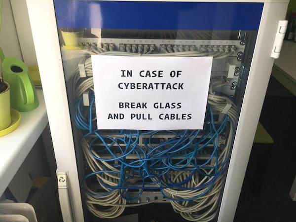
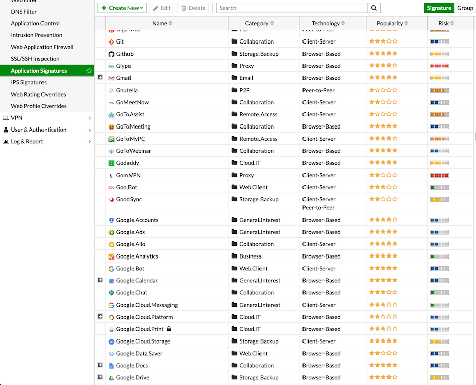
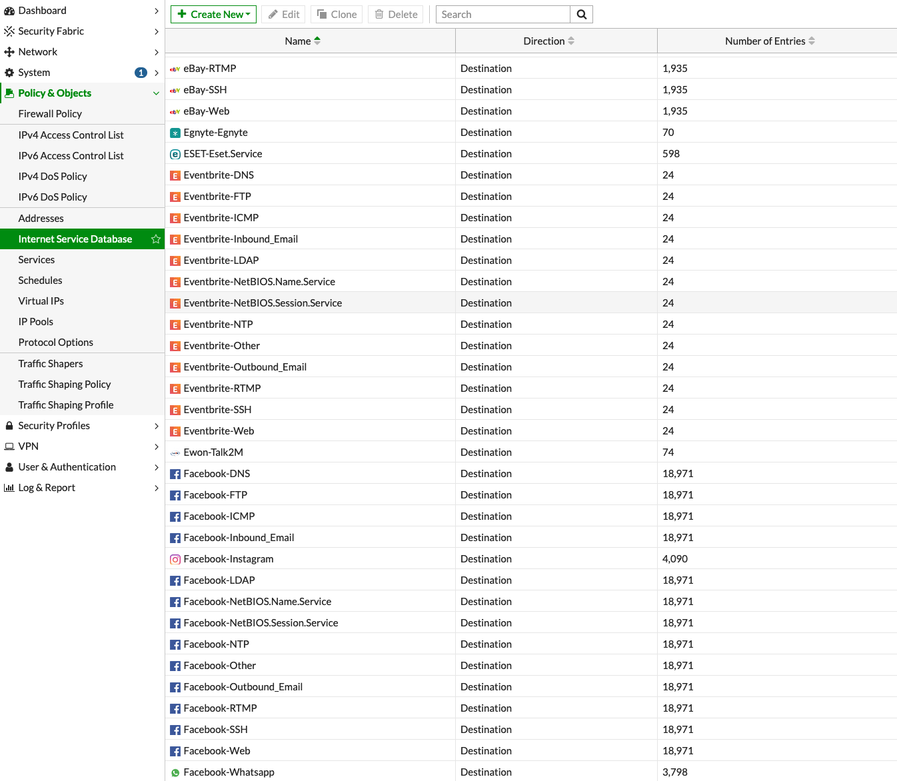
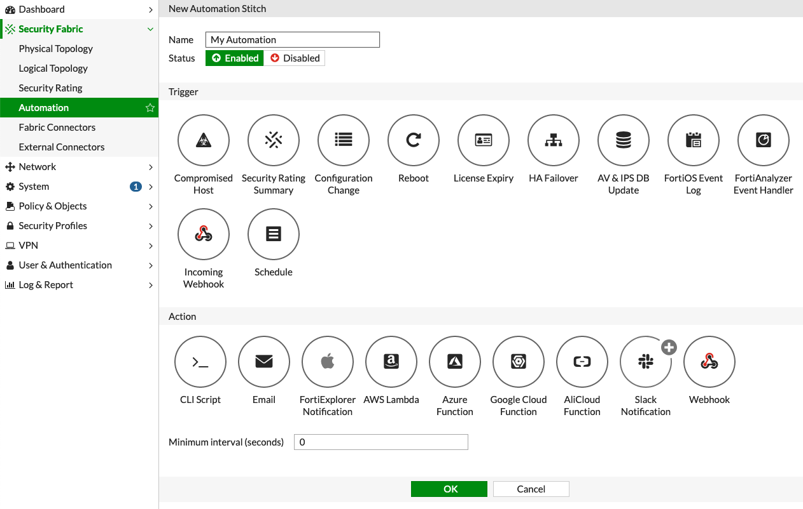
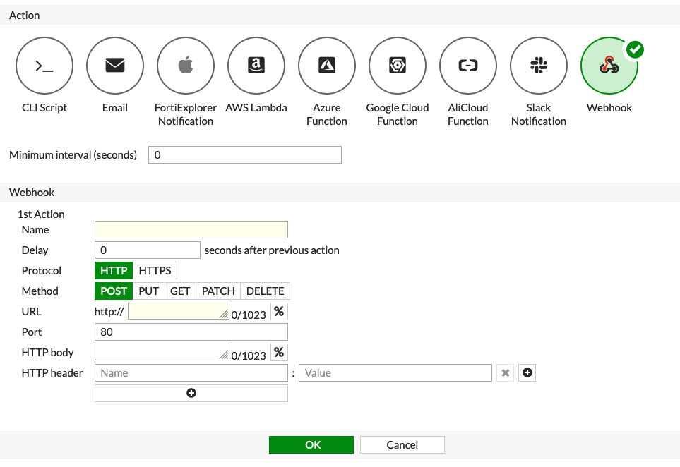
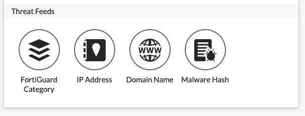
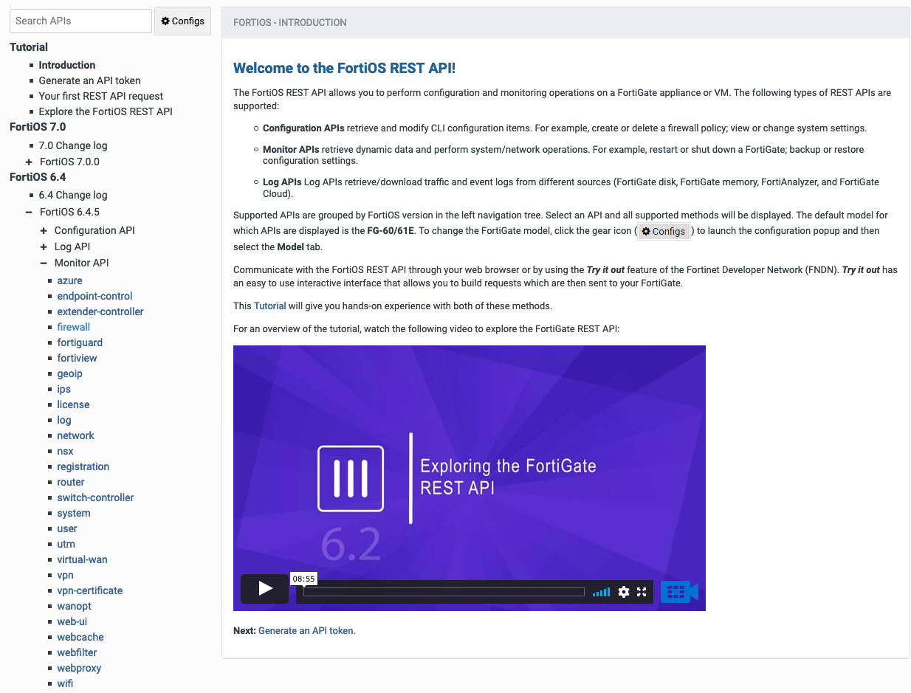

# Fortinet Security Session

## Stuff I Like

### Truly NGFW

Where some other firewall vendors have struggled with the transition to Next Generation Firewall capabilities, Fortinet has been here for a long time.

With Fortinet, you typically implement firewall policies in terms of application types, but you can jump back to ports and IP addresses where desired.

### Internet Services Database (ISDB) and Application Control

No longer are you resigned to always entering complex firewall rules with vast lists of IPs and ports.

The Internet Service Database is a comprehensive public IP address database that combines IP address range, IP owner, service port number, and IP security credibility. The data comes from the FortiGuard service system. Information is regularly added to this database, for example, geographic location, IP reputation, popularity & DNS, and so on. All this information helps users define Internet security more effectively. You can use the contents of the database as criteria for inclusion or exclusion in a policy.

[Online help for ISDB](https://docs.fortinet.com/document/fortigate/6.4.5/administration-guide/849970/policy-with-internet-service)

### Automation Stitches

Automation stitches allow you to set up automatic actions in response to Security Fabric events, such as a compromised host, downed connection, HA failover, or practically any other event.

Some of the kinds of actions you can perform for an event:

* Run a script
* Send an email or Slack message
* Fire off a webhook (super useful and flexible!)
* Execute an Azure/Google Cloud function

Yes, you *can* configure multiple actions to run.

[Online help for Automation Stitches](https://docs.fortinet.com/document/fortigate/6.4.5/administration-guide/139441/automation-stitches)

### External Connectors (Threat Feeds)

External connectors allow you to connect to multiple public and private clouds, as well as subscribe to threat feeds.

Threat feeds are cool because they allow you to subscribe to open lists like OpenPhish, SpamHaus, the various malware hash feeds, and so on. You can adapt these threat feeds to a variety of firewall policy types.

Threat Feed Types are:

* FortiGuard Category - AKA a plaintext list of URLs
* IP Address - A plaintext list of IP addresses (individual or CIDR)
* Domain Name - A plaintext list of domain names. Wildcards accepted
* Malware Hash - AKA a list of file hashes 

### REST APIs

Most of Fortinet's product lines, including Fortigate and FortiAnalyzer, have REST API functionality built-in.

[REST API Documentation](https://fndn.fortinet.net/) - Account required ☹️

## Fortinet Training

Fortinet offers a bunch of great online training, and it's currently free during the pandemic.

Each course has a great table of contents that lets power users skip around material quickly.

Check it out: https://training.fortinet.com/

## FortiAnalyzer

Spoiler: It's PostgreSQL on Linux under the hood, but you don't need to know Linux or PostgreSQL to use FortiAnalyzer.

FortiAnalyzer comes with a bunch of canned reports, but to write your own, it helps to know some basic SQL (or know enough to steal and modify from the canned reports).

### Keys to understanding FortiAnalyzer reporting

There is a bit of a learning curve. The [free online training](https://training.fortinet.com/) is excellent!

#### It is important to understand how the components of a FortiAnalyzer report fit together

* Dataset: A dataset is essentially a SQL query and the resulting table of data.
* Chart: A chart is a report component fed by data from a dataset. A chart can be in the form of a pie graph, a line graph, a table, et cetera.
* Report: A report is pretty much a collection of charts.

### Links

* [/r/fortinet on Reddit](https://old.reddit.com/r/fortinet/)
* [Fortinet Guru on YouTube](https://www.youtube.com/channel/UC-rd6xdOuYdWxON1sUOCyUA)
* [Fortinet on YouTube](https://www.youtube.com/c/fortinet/)
* [Fortigate Docs](https://docs.fortinet.com/product/fortigate/6.4)
* [FortiAnalyzer Docs](https://docs.fortinet.com/product/fortianalyzer/6.4)
* [FortiAnalyzer Dataset Reference](https://docs.fortinet.com/document/fortianalyzer/6.4.5/dataset-reference/398203/introduction)
* [Fortinet Developer Network](https://fndn.fortinet.net/) - You will need to sign up for an account and get your rep to approve it.

